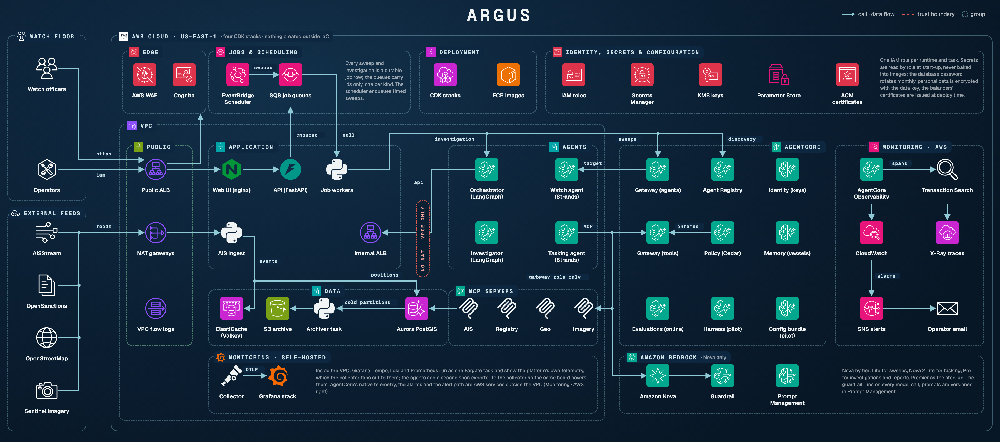

# Argus technical reference

Read `ARCHITECTURE.md` first. This document is the engineer's reference: repository layout, every service, configuration, the data model in detail, the job and event model, build and deployment, and the conventions that are easy to get wrong.

## 1. Repository layout

```
agents/            four agents (watch, investigator, tasking, orchestrator) + shared/ (config, models, graph, policy, provenance, prompts)
mcp-servers/       one image, four servers (ais, registry, geo, imagery) + common/ (db, telemetry, callerauth, datakey, safety)
services/api/      FastAPI platform API, worker, job queue, A2A client, callerauth, datakey
services/ais-replay/  scenario loader + replay/live ingest, ownership-network builder
services/archiver/ positions → Parquet
services/ui/       single-page watch floor behind nginx
data/sql/          numbered, idempotent migrations (applied on every start)
data/scenarios/    synthetic scenarios (fictional); data/synthetic/generator.py builds positions and ground truth
evals/             node evals, cases, thresholds, e2e script, Inspect task, scoring helpers
tests/             unit tests (dependency-free) and tests/integration (PostGIS)
infra/cdk/         four stacks + lifecycle.py (pause flag, model guard)
observability/     collector, Prometheus (+ alert rules), Tempo, Loki, Grafana dashboards
docs/              ADRs, roadmap, this reference, API, use cases, runbook, security
```

Python 3.12 everywhere; dependencies are exactly pinned in seven per-image `requirements.txt` files; containers install with `uv`, CI with `pip`. Ruff (line length 88) is the only linter and formatter.

## 2. Services

### 2.1 API (`services/api/main.py`)

- System of record for alerts, investigations, review states, tasking decisions, jobs, evidence snapshots, eval runs, audit events.
- Human endpoints take the officer from the load balancer's signed id token on AWS and from the `X-Watch-Officer` header locally (ADR-0018); agent-only endpoints (`POST /alerts`, `/investigations/{id}/complete|fail|progress`) require a verified IAM identity when `TOOL_AUTH=aws-iam`.
- Investigation policy: `AUTO_INVESTIGATE_SEVERITIES` (default `high`) opens an investigation job for matching alerts, keyed by alert id.
- Evidence snapshots on alert creation and investigation completion; manifest stored on completion with evidence snapshot ids attached.
- SLIs (`/slo`, `/metrics`) computed from `jobs`, `investigations`, `alerts`, `eval_runs`; cost from manifest token usage × price table (`MODEL_PRICES_JSON` overrides).
- SSE: `/stream` (positions from Redis `ais:positions`), `/events` (job progress from `argus:events`).

### 2.2 Worker (`services/api/worker.py`, `jobqueue.py`, `a2a_client.py`)

- Backends: Redis Streams consumer group (local) or SQS (AWS), one queue per job kind (`argus-sweeps`, `argus-jobs`) and one worker service per kind on AWS (`WORKER_QUEUE_KIND`); the job row is claimed with a conditional `UPDATE` before running, so at-least-once delivery is safe. The worker extends the message's visibility every 30 s while a handler runs; a redelivery that finds a `running` row past its timeout reclaims it (ADR-0016). The timeout ladder `node × depth < timeout_s < visibility < timeout_s + grace` is pinned by `tests/test_jobs.py`.
- Handlers: `sweep` sends one A2A `message/send` to the Watch agent (SigV4-signed on AWS, URL from SSM `/argus/watch-a2a-url`); `investigation` invokes the orchestrator (local HTTP or AgentCore `InvokeAgentRuntime`).
- Retries: transient failures (connectivity, 5xx, throttling) with backoff 30, 60, 120 s up to `max_attempts` (3); permanent failures fail fast; exhausted retries go `dead` (Redis DLQ stream / SQS redrive) and the investigation is marked failed.
- Scheduler: `SWEEP_INTERVAL_MIN` locally; on AWS EventBridge Scheduler sends `{"schedule": "sweep"}` to SQS and the worker turns it into a job on the interval-bucket idempotency key.
- Progress: every handler step publishes to `argus:events` and appends to `jobs.progress`.

### 2.3 Orchestrator (`agents/orchestrator/app.py`, `agents/shared/graph.py`)

The investigation graph in code. Node timeouts (`NODE_TIMEOUT_S`, 480 s). Report node: Strands agent with no tools on the strong tier, `structured_output(VesselOfInterestReport)`, validated by `shared/policy.validate_report`, one retry with the violations. Provenance manifest built by `shared/provenance.py` from per-node info (specialists expose `/provenance`), prompt hashes, `GIT_SHA`, MCP `/health` versions. Persistence is done in code (`persist()`), never by a model.

### 2.4 Specialist agents

| Agent | Framework | Tools | Tier | Notes |
|---|---|---|---|---|
| Watch | Strands, A2A server | ais, geo, `list_candidates`, `raise_alert`, `dismiss_candidate` | fast | Detector candidates are built in code; the model raises or dismisses them by id; alerts are POSTed to the API as it goes |
| Investigator | LangGraph `create_react_agent`, a2a-sdk server | ais, registry, geo | strong | `Scope: identity` or `Scope: behaviour` in the message; escalates one tier when output fails validation; attaches `provenance` (model, tier, prompt hash, attempts, token usage) |
| Tasking | Strands, A2A server | imagery, geo | standard | Creates `proposed` tasking rows only |

All agents block at import until their MCP servers answer `/health` (Strands binds tools at construction). Prompts are `str.format` templates: literal braces must be doubled.

### 2.5 MCP servers (`mcp-servers/`)

One image; `MCP_SERVER` selects `ais | registry | geo | imagery`. On AWS each runs as an AgentCore Runtime (protocol MCP) behind the AgentCore Gateway; `mcp-servers/tools.json` (`make tools-inventory`) is the inventory the registry records and the Cedar policies are built from. Streamable HTTP at `/mcp`, `/health` with the tool list and `VERSION`. `common/callerauth.py` verifies callers (`TOOL_AUTH=aws-iam`) by forwarding their STS-signed token to STS and checking the role against `TOOL_ALLOWED_ROLES`. `common/safety.untrusted()` marks and caps free text from external sources. `common/telemetry.traced_tool` makes every tool call a span with `mcp.tool.*` and `mcp.server.version`.

### 2.6 Replay / ingest (`services/ais-replay/replay.py`, `network.py`)

On start: apply every `data/sql/*.sql` except `000_*` (idempotent), load reference data, encrypt personal data, build the ownership network (entities and edges from registry rows; rendezvous edges from positions with the detector's proximity rule), ensure daily partitions, bulk-load positions, publish the area and ground truth to the `scenario_meta` table (and `/app/shared` locally), then stream positions at `REPLAY_SPEED` and loop (`REPLAY_LOOP`). Live mode subscribes AISStream to the scenario bounding box.

### 2.7 Archiver (`services/archiver/archive.py`)

`positions_expired_partitions(hot_days)` → export to Parquet (zstd) → verify object → `positions_drop_partition` → audit event. `ARCHIVE_BUCKET` (S3, KMS) or `ARCHIVE_DIR`. Daily ECS scheduled task on AWS; `make archive` locally.

## 3. Configuration

### Agents (`agents/shared/config.py`)

| Variable | Default | Purpose |
|---|---|---|
| `MODEL_PROVIDER` | `bedrock` | `bedrock \| anthropic \| openai \| gemini`; AWS refuses non-bedrock |
| `MODEL_ID` | empty | Pins every tier to one model |
| `MODEL_ID_FAST/STANDARD/STRONG` | Nova Lite / Nova 2 Lite / Nova Pro | Per-tier model |
| `MODEL_TIER_WATCH/TASKING/INVESTIGATOR/REPORT` | fast / standard / strong / strong | Per-role tier |
| `MODEL_TEMPERATURE`, `MODEL_MAX_TOKENS` | 0.1, 4096 | Dropped for models that reject sampling |
| `MCP_*_URL`, `API_URL`, `A2A_*_URL` | compose service names | Endpoints |
| `A2A_AUTH` | `none` | `sigv4` on AWS |
| `TOOL_AUTH` | `none` | `aws-iam` on AWS for the agent-only API routes (STS-signed caller tokens); tool servers use `none` behind the gateway |
| `TOOL_GATEWAY_URL` | empty | AWS: the AgentCore Gateway MCP endpoint; empty means direct per-server URLs (compose) |
| `ARGUS_REGISTRY_ID` | empty | AWS: the Agent Registry the orchestrator and worker search for agent addresses (also SSM `/argus/registry-id`); `A2A_*_URL` is the fallback |
| `TASKING_HARNESS_ARN` | empty | AWS pilot: when set (CDK context `taskingViaHarness=true`) the tasking node calls the AgentCore Harness instead of the Tasking runtime |
| `OPENSANCTIONS_CREDENTIAL_PROVIDER` | empty | Registry server on AWS: the AgentCore Identity API-key provider exchanged for the key with the invocation's workload access token; the secret ARN stays the fallback |
| `SCENARIO_END` | `2026-09-01T08:00:00Z` | The scenario clock ("now") |
| `AGENTCORE_MEMORY_ID`, `BEDROCK_GUARDRAIL_ID` | empty | Optional |
| `NODE_TIMEOUT_S` | 480 | Orchestrator per-node timeout |
| `GIT_SHA` | baked at build | Provenance |

### Platform

| Variable | Purpose |
|---|---|
| `DATABASE_URL` or `PG*` | PostGIS |
| `REDIS_URL` | streams |
| `JOB_BACKEND` (`redis \| sqs`), `JOB_QUEUE_URL` | job queue |
| `AUTO_INVESTIGATE_SEVERITIES` | investigation policy |
| `SWEEP_INTERVAL_MIN`, `SWEEP_HOURS` | local scheduler |
| `TOOL_AUTH`, `TOOL_ALLOWED_ROLES`, `TOOL_ALLOWED_ACCOUNT` | caller verification (agents, and the `argus-operator` role for tooling) |
| `OFFICER_AUTH` (`header \| oidc`), `OIDC_SIGNER`, `OIDC_ISSUER` | watch-floor identity: the typed header locally, the load balancer's signed id token on AWS (ADR-0018) |
| `PGPASSWORD_SECRET_ARN` | re-read the rotated database password on connection failure |
| `JOB_SWEEP_QUEUE_URL`, `WORKER_QUEUE_KIND` | the sweeps queue and which queue a worker drains |
| `DATA_KEY` or `DATA_KEY_SECRET_ARN` | personal-data encryption key |
| `MODEL_PRICES_JSON`, `SLO_MAX_COST_PER_INVESTIGATION`, `SLO_MIN_EVAL_RECALL` | SLIs |
| `POSTGIS_IMAGE` | local only; Apple Silicon needs the community multi-arch image |

### CDK context (`infra/cdk/cdk.json`)

`modelProvider`, `modelId`, `bedrockModelVendors` (default `amazon`), `allowExternalModelProviders`, `paused`, `retainArchive`, `retainData`, `auroraReader`, `natPerAz`, `sweepIntervalMinutes`, `autoInvestigateSeverities`, `uiAllowedCidr`, `uiCertificateArn`, `officerEmail`, `officerMfa`, `operatorPrincipalArn`, `alertEmail`, `transactionSearch`, `bundleOverride`, `taskingViaHarness`, `nag`, `scenarioEnd`, `aisMode`, `watchAreas`, `openSanctions`, `agentcoreAzs`, `grafanaStack`, `gitSha`.

## 4. Data model


Migrations in `data/sql/`, numbered, idempotent, applied in order on every start (`000_*` creates the CloudWatch GenAI Observability database and is skipped by the replay loader).

| Table | Purpose | Notes |
|---|---|---|
| `vessels`, `registry` | Static identity; registry ownership, flag history, sanctions, fleet | `beneficial_owner` cleared after encryption into `beneficial_owner_enc` |
| `positions` | AIS reports | Range-partitioned by day (`positions_pYYYYMMDD` + default); no primary key; GIST on geom |
| `zones` | Protected cable corridors, exclusion areas, anchorages, port approaches | Geography polygons |
| `alerts` | Watch-agent findings | `status` (open/investigated/dismissed), `review_state` (draft/accepted/rejected), reviewer, evidence in `details` |
| `investigations` | Cases and VOI reports | `status`, `review_state`, `job_id`, `alert_id`, `trace_id`, `manifest` |
| `tasking_requests` | Proposed actions | `proposed/approved/rejected`, `decided_by` |
| `entities`, `edges` | Ownership network | `ownership_network(key, depth)` traversal; `entity_upsert`, `edge_upsert` |
| `evidence_snapshots` | What findings cited, at the time | positions, registry, ownership_network, tool_output |
| `jobs` | Sweeps and investigations | `status`, `attempts`, `not_before`, `progress`, idempotency key (unique while active) |
| `audit_events` | Every state change | append-only trigger |
| `eval_runs` | Eval results | feeds the eval-recall SLO |
| `retention_policy` | Retention as data | positions 90 days hot → Parquet; findings and audit 7 years |

Functions: `positions_ensure_partitions`, `positions_partitions`, `positions_expired_partitions`, `positions_drop_partition`, `ownership_network`, `entity_upsert`, `edge_upsert`, `audit_events_immutable` (trigger).

## 5. Job lifecycle

| From | To | When |
|---|---|---|
| (new) | `queued` | `enqueue` under an idempotency key; an active duplicate is returned instead |
| `queued` | `running` | the worker claims it with a conditional UPDATE |
| `running` | `succeeded` | the handler returns |
| `running` | `queued` | transient failure; retried after `not_before` with backoff |
| `running` | `failed` | permanent failure (`is_transient` says no) |
| `running` | `dead` | retries exhausted; the SQS copy lands in the dead-letter queue |
| `running` | `running` | a redelivery finds the row past `timeout_s` + margin: reclaimed by the new worker (attempts + 1, progress `reclaimed`) |

Idempotency keys: sweeps `sweep:<hours>h:<interval bucket>`; investigations `investigation:<mmsi>:alert:<alert id>` or `investigation:<mmsi>:<trigger>:<6 h bucket>`.

## 6. Provenance manifest

Stored in `investigations.manifest` on completion:

```json
{"manifest_version": 1, "code_revision": "<git sha>", "schema_version": "1.1",
 "prompts": {"investigator": "<sha256 prefix>", "report": "...", "tasking": "...", "watch": "..."},
 "nodes": [{"node": "investigator_identity", "agent": "investigator", "provider": "bedrock", "model_id": "us.amazon.nova-pro-v1:0", "tier": "strong", "attempts": 1, "usage": {"inputTokens": 0, "outputTokens": 0}}, ...],
 "mcp_servers": {"ais": "0.2.0", "registry": "0.2.0", "geo": "0.2.0", "imagery": "0.2.0"},
 "evidence_snapshots": ["<uuid>", ...]}
```

## 7. Build and deployment

- Local: `cp .env.example .env`, `make up`; `make stop`/`make start`/`make down`. Compose builds per-service images; the shared volume is mounted at `/app/shared` (outputs), never `/app/data`.
- CI (`.github/workflows/ci.yml`): ruff check and format, unit tests (four packages only), CDK synth, compose config; a second job runs the detector evals against a PostGIS service. `.github/workflows/evals.yml` runs node evals nightly and on prompt or model changes when `EVAL_API_URL` is configured.


- AWS: `make deploy` = `scripts/deploy.sh` (bootstrap, `cdk deploy --all`, `GIT_SHA` baked into agent images; platform images amd64, AgentCore images arm64). The script reads `AIS_MODE`, the feed keys and `OFFICER_EMAIL` / `OFFICER_MFA` from the environment or `.env`, passes the officer settings as CDK context and stores the keys in the stacks' secrets afterwards; synth bundles the certificate-issuer Lambda with Docker. Run it as the `argus-deployer` role through an AWS profile with MFA. `make stop-aws` / `make start-aws` toggle `paused`. `make destroy` = `scripts/destroy.sh` (destroy all stacks, `cdk gc`). `make eval-aws` runs the node evals against the deployment as `argus-operator`; `make rekey-aws` re-keys the personal-data columns.

## 8. Conventions that bite

- Never put agent work in a FastAPI background task: create a job.
- Never add a primary key or `ON CONFLICT` to `positions`.
- Always cast parameters when calling SQL functions from psycopg (`%s::bigint`).
- `callerauth.py` and `datakey.py` are duplicated across images on purpose; tests assert the copies are identical.
- Any free text from an external source returned by an MCP tool goes through `untrusted()`.
- Prompts: `{scenario_end}` and `{schema}` are the only placeholders; JSON braces must be doubled.
- The UI attaches map layers on MapLibre's `style.load`, merges the basemap underneath afterwards, and never calls `setStyle`.
